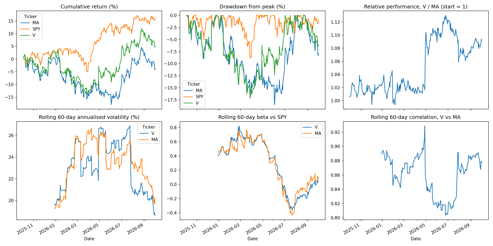
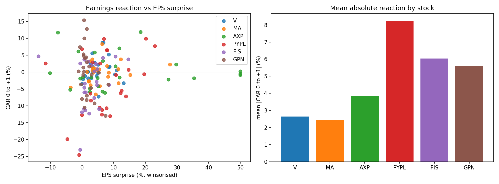
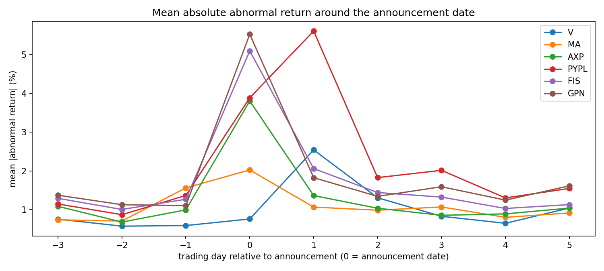
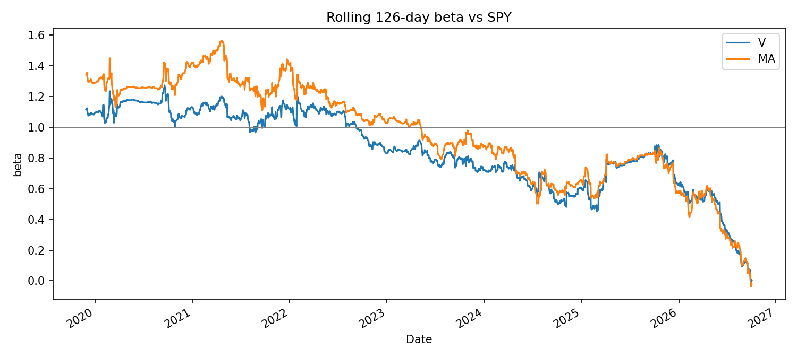

# V vs MA: Risk Profile and Earnings Reactions

Python analysis of Visa (V) and Mastercard (MA) against the S&P 500 (SPY): a risk profile over a fixed one-year window, and an event study of earnings reactions across V, MA and four payments peers (AXP, PYPL, FIS, GPN).

## Findings
- V's 8.8-point lead over MA over the year is ordinary for the pair: about 0.6 to 0.7 standard deviations of their annualised tracking error (11.7%), depending on the exact one-year window.
- Earnings days move these stocks roughly 2 to 6 times more than normal days, in all six stocks (p <= 0.002 each).
- Neither the EPS surprise nor the prior 60-day run-up predicts the direction of the earnings reaction in this sample (hypotheses written down before running, results reported as found).
- V and MA earnings windows explain only +1.9 points of the +7.5-point one-year gap; the rest accrued on other days.

## 1. Risk profile (2025-10-03 to 2026-10-02, `run_analysis.py`)
| | Total return | vs SPY | Ann. vol | Downside dev | Max drawdown | Beta vs SPY | Sharpe | Sortino |
|---|---|---|---|---|---|---|---|---|
| V | 5.09% | -11.16% | 22.03% | 14.21% | -17.18% | 0.29 | 0.17 | 0.26 |
| MA | -3.75% | -19.99% | 22.41% | 15.80% | -18.48% | 0.29 | -0.22 | -0.32 |
| SPY | 16.25% | n/a | 13.01% | 8.84% | -8.88% | 1.00 | 0.94 | 1.39 |

Sharpe = (average daily return x 252 - risk-free rate) / annualised volatility, with the risk-free rate set to the average 3-month T-bill yield (^IRX) over the sample (printed by the script). Downside deviation counts only days below 0. Drawdown counts the starting $1 as the first peak.

V and MA move together (daily return correlation 0.86). Their link to the market has weakened steadily: beta vs SPY was about 1.1 for V and 1.3 for MA in 2019-2021, 0.6-0.9 for both in 2023-2025, and about 0.25 in 2026 to date (weekly-return beta over the last three years: V 0.72, MA 0.78; last 60 trading days, daily: V 0.03, MA 0.07). The one-year beta of 0.29 is therefore real but recent, and "return vs SPY" (a beta-of-1 comparison) overstates how much they underperformed what their market exposure implies. I have not tested why the link weakened.



## 2. Earnings event study (`event_study.py`)
Market-model abnormal returns: beta and alpha vs SPY estimated on the 250 trading days ending 30 days before each reaction day. Primary window is [0, +1] from the announcement date. 25 releases per stock, 150 events.

| Stock | Beat rate | Mean abs. reaction [0,+1] | Abs. abnormal return, earnings day vs other days |
|---|---|---|---|
| V | 96% | 2.6% | 2.56% vs 0.78% |
| MA | 96% | 2.4% | 2.00% vs 0.87% |
| AXP | 80% | 3.9% | 3.81% vs 0.98% |
| PYPL | 80% | 8.3% | 7.90% vs 1.35% |
| FIS | 84% | 6.0% | 5.25% vs 1.11% |
| GPN | 84% | 5.6% | 5.56% vs 1.18% |

- **H1 (earnings days are bigger than normal days): supported** for every stock (Welch t-test on absolute values, p <= 0.002; approximate with n = 25).
- **H2 (reaction rises with EPS surprise): not supported.** Peers only: slope +0.0007 per percentage point of surprise (R2 = 0.01, p = 0.33; Spearman rho = 0.05, p = 0.65). V and MA only: slope +0.0012 (R2 = 0.03, p = 0.23).
- **H3 (reaction falls with the prior 60-day market-adjusted run-up): not supported.** Peers only: slope +0.023 (R2 = 0.001, p = 0.71), the opposite sign. V and MA only: slope +0.067 (R2 = 0.02, p = 0.35).
- 36 p-values are reported across the H2 and H3 regressions. One falls below 0.05 (V, Spearman, H3, p = 0.03, wrong sign), about what chance produces, so I do not treat it as a finding.



## 3. Why did V and MA diverge?
The one-year gap (summed daily returns 8.67%; tracking error 11.68%; ratio 0.74, or 0.64 over the last 252 trading days) is ordinary for the pair. The largest single-day gap was Visa's reaction on 2026-04-29 (+8.26% vs MA +3.47%) after it reported fiscal Q2 after the close on 2026-04-28: adjusted EPS $3.31 vs. $3.10 consensus, revenue +17%, raised full-year guidance, and a $20B buyback. But earnings windows did not drive the full-year gap: V and MA earnings windows contributed +1.93 points of +7.51, and other days +5.59, because V's April gain was partly offset by MA outperforming V by about 2.8 and 3.2 points on its own earnings days in January and July. MA beat Q1 consensus (adjusted EPS $4.60 vs. $4.41) but fell on 2026-04-30, apparently because April-to-date data showed slowing cross-border growth. The explanations for the two April moves come from news coverage and have not been checked against primary filings. The largest gap days come from an exploratory listing in `run_analysis.py`; picking the top five after the fact is not a test.

## Pre-registered hypotheses (written before running the tests)
H3: the earnings reaction (CAR[0,+1]) is negatively related to the stock's market-adjusted return over the 60 trading days before the announcement. Primary test: pooled regression across both stocks, predicted slope < 0. The per-stock regressions are secondary.

V and MA were analysed first. I then added four peers (AXP, PYPL, FIS, GPN) as a replication on new data. Primary tests: H2 (reaction rises with EPS surprise, slope > 0) and H3 (slope < 0), on the peers-only sample. EPS surprise is winsorised at +/-50 percentage points and Spearman rank correlation is the robustness check. I will not change windows or the model after seeing results. Events in the same quarter share market conditions, so p-values on pooled samples are optimistic.

## Data checks (Phase 0 diagnostics)
- Prices: 1,845 trading days (2019-06-03 to 2026-10-02), no duplicate dates, longest gap 4 days (Labor Day weekend). The largest daily moves fall on known events (March 2020; SPY +10.5% on 2025-04-09).
- Earnings timing: Visa reports after the close. Yahoo stamps 16:00 for 47 of 49 Visa events, and day +1 has the larger market-adjusted move in 40 of 49. Two events are stamped 06:00, probably wrongly. Visa's 2026 release dates (Jan 29, Apr 28, Jul 28) were confirmed against its filings and press releases. Mastercard releases before the open (its July 30 call was at 9:00 a.m. ET), but Yahoo's timestamps (mostly 08:00) are approximate, and day 0 had the larger move in only 19 of 49 events. The primary [0, +1] window is robust to this; the event-time profile below shows MA peaking on day 0, as expected for a before-open release, so the day-count is a noisy measure.

## Event-time profile: timing and spillovers
Mean absolute abnormal return in %, by trading day relative to the announcement date (day 0). Day 0 is the announcement date itself, so the profile does not depend on the before-open / after-close assumption (`run_analysis.py`).

| Day | V | MA | AXP | PYPL | FIS | GPN |
|---|---|---|---|---|---|---|
| -3 | 0.76 | 0.74 | 1.09 | 1.15 | 1.29 | 1.37 |
| -2 | 0.58 | 0.71 | 0.68 | 0.87 | 1.01 | 1.13 |
| -1 | 0.59 | 1.56 | 0.99 | 1.37 | 1.27 | 1.10 |
| 0 | 0.76 | 2.03 | 3.80 | 3.89 | 5.10 | 5.53 |
| 1 | 2.54 | 1.07 | 1.36 | 5.61 | 2.06 | 1.83 |
| 2 | 1.31 | 0.99 | 1.04 | 1.83 | 1.44 | 1.34 |
| 3 | 0.83 | 1.07 | 0.85 | 2.02 | 1.32 | 1.59 |
| 4 | 0.65 | 0.80 | 0.89 | 1.30 | 1.03 | 1.25 |
| 5 | 1.04 | 0.92 | 1.04 | 1.55 | 1.13 | 1.61 |



- Peak day: V on day +1 (reports after the close); MA, AXP, FIS and GPN on day 0 (before the open). PYPL peaks on day +1 but also has a large day 0, so its Yahoo timestamps look mixed. This supports the timing used in the event study.
- Possible spillover (a hypothesis, not tested): MA's day -1 (1.56 vs about 0.7 on days -3 and -2) and V's day +2 (1.31 vs 0.58-0.83 on other non-reaction days) are elevated. In April and July 2026 Visa reported on a Tuesday after the close and Mastercard on the Thursday before the open, so MA's day -1 was Visa's reaction day and V's day +2 was Mastercard's announcement day. For example MA rose 3.47% on 2026-04-29 and V fell 1.50% on 2026-04-30. This looks like earnings news transferring between the two companies. If true, V and MA events are not independent, so the pooled p-values above are optimistic.

## Beta over time
Rolling 126-day beta of V and MA vs SPY, 2019-2026 (`outputs/rolling_beta.png`).



## Limitations
- One year of data for the risk figures; 25 events per stock for the event study.
- Yahoo Finance data is not institutional quality. Consensus EPS is a rough proxy, and AXP's mean surprise of 36% reflects outliers (surprise is winsorised for the regressions). No revenue or guidance data, which likely drive reactions; that is untested.
- Beta and correlation with SPY are unusually low for V and MA this year and should not be read as long-run properties.
- Annualised volatility assumes returns are roughly independent and normal; real returns have fatter tails.
- Pooled p-values are optimistic because events in the same quarter share market conditions.
- Peers were chosen by me, not by a screen. GPN and FIS had large corporate events in the sample.
- Historical risk does not predict future risk.

## Project structure and how to run
- `config.py`: the pair, peers, benchmark, dates, and the event-study design choices
- `data.py`: downloads and caches data (Yahoo Finance) in `data/raw/`
- `risk.py`: returns, volatility, drawdown, beta, Sharpe, Sortino (no downloads)
- `event_study.py`: market-model abnormal returns, tests, regressions (no downloads)
- `run_analysis.py`: runs everything and writes tables and charts to `outputs/`
- `test_core.py`: tests for the core calculations

```
pip install -r requirements.txt
python -m pytest -q
python run_analysis.py
```

Change `TICKER_A`, `TICKER_B` and `PEERS` in `config.py` to run another pair. V and MA release timing is set in `RELEASE_TIMING`; other stocks use Yahoo's timestamp, which is approximate. Delete `data/raw/` to download fresh data.

