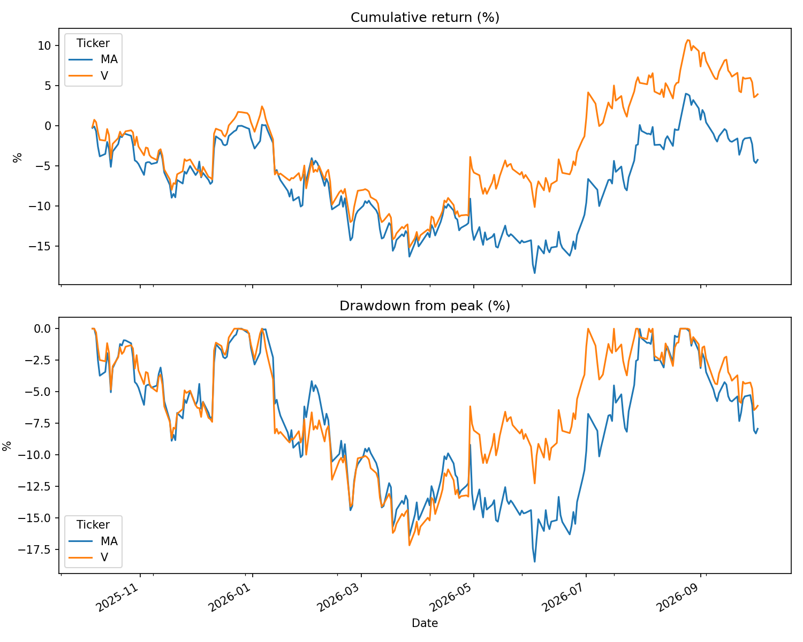

## Pre-registered hypothesis (written before running the test)
# Price & Risk Analyzer

Compares the risk profile of Visa (V) and Mastercard (MA) over the trailing year using Python.

## Question
How do two near-identical businesses differ in volatility, drawdown, and co-movement?

## Method
- Daily closing prices from Yahoo Finance via `yfinance`
- Daily returns and annualized volatility (daily std x sqrt(252))
- Max drawdown from compounded returns
- Return correlation matrix

## Results (trailing 1 year as of 2026-10-02)
| | Annual vol | Max drawdown |
|---|---|---|
| MA | 22.45% | -18.48% |
| V | 22.05% | -17.18% |

Return correlation: 0.86.

## Observations
Almost all of the roughly 8-point gap between V and MA came from two days. Visa reported fiscal Q2 after the close on 2026-04-28 and rose 8.26% the next day (MA +3.47%). On 2026-04-30, MA's own earnings day, MA fell 4.25% and V fell 1.50%. V's cumulative outperformance was under 3 points through March, reached 8.76 by the end of April, and stayed between about 6 and 11 afterward. Visa beat consensus adjusted EPS ($3.31 vs. $3.10), grew revenue 17%, raised full-year guidance, and announced a $20B buyback. MA beat Q1 consensus (adjusted EPS $4.60 vs. $4.41, revenue $8.4B vs. about $8.26B) but fell on 2026-04-30, apparently because April-to-date data showed slowing cross-border growth; it was also trading near its 52-week low. Both companies beat estimates, but V rose on accelerating revenue and a raised outlook while MA fell on decelerating current-quarter trends. This explanation comes from news coverage and has not been checked against Mastercard's primary filings. For scale, this gap is within normal range for the pair (see the event study below): it is the concentration in two earnings days that is notable, not the size of the gap.

## Limitations
- One year of data is a small sample.
- Yahoo Finance data is not institutional quality.
- Volatility assumes returns are roughly normal. Real returns have fatter tails.
- Historical risk does not predict future risk.

## Run it
pip install yfinance pandas matplotlib
python analyzer.py

## Event study: what moves V and MA around earnings?
Market-model abnormal returns (beta vs. SPY estimated on the 250 trading days ending 30 days before each release). Primary window is [0, +1] from the announcement date. Windows and tests were fixed before running. Sample: 25 releases per stock.

- The one-year V-minus-MA gap (7.5%, summed daily) is about 0.6 standard deviations of the pair's annualised tracking error (11.7%), so a gap that size is ordinary for two stocks with 0.86 correlation.
- Earnings reactions are large relative to normal days: mean absolute abnormal return on the reaction day was 2.56% (V) and 2.00% (MA) vs 0.78% and 0.87% on other days (Welch t-test on absolute values, p = 0.001 and p < 0.001).
- The EPS surprise explains little of the reaction: R2 = 0.03 (pooled, n = 50, p = 0.23). Both stocks beat consensus in 24 of 25 quarters, so the surprise has almost no variation, and the sample is too small to rule out a modest effect.
- Earnings windows are 4.8% of trading days but 19% of the gap's squared daily moves.

## Pre-registered hypothesis (written before running the test)
H3: the earnings reaction (CAR[0,+1]) is negatively related to the stock's market-adjusted return over the 60 trading days before the announcement. Primary test: pooled regression across both stocks, predicted slope < 0. The per-stock regressions are secondary.

